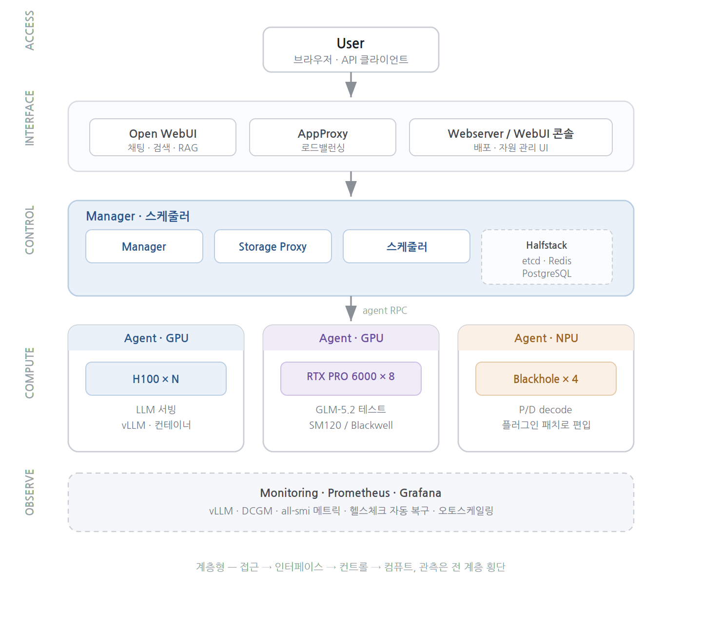
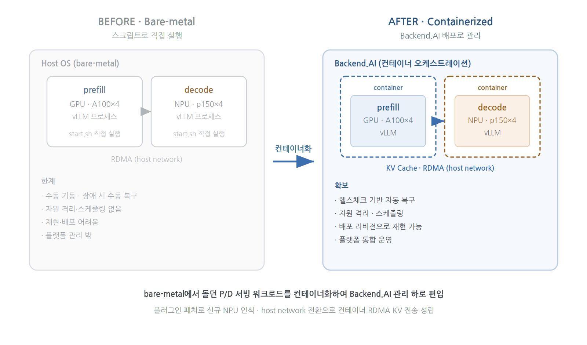
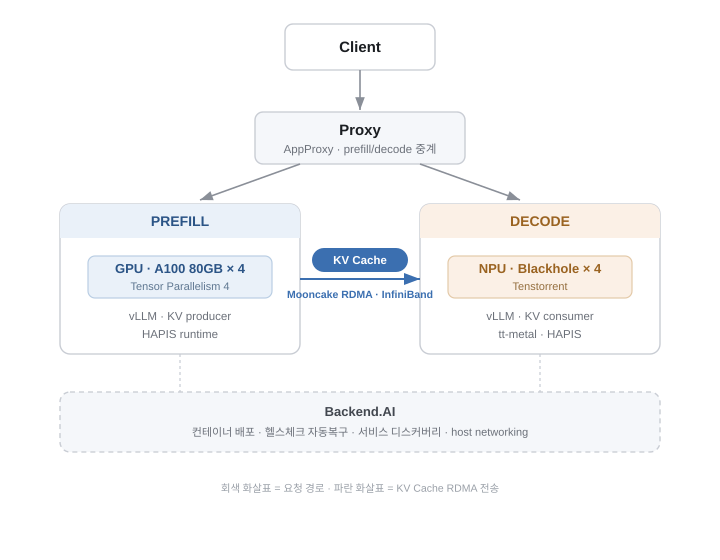
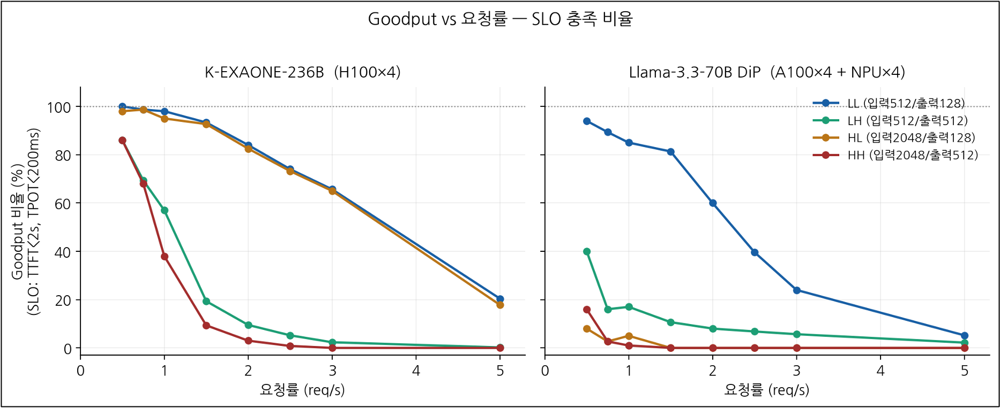
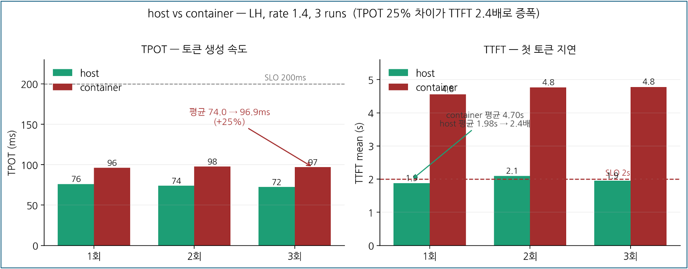

AI 컴퓨팅 오케스트레이션 플랫폼(Backend.AI)을 온프레미스 GPU/NPU 인프라에 구축·운영하고, 그 위에서 이기종 가속기(GPU + NPU) 기반 LLM 서빙을 컨테이너화했다.

---

## 1. Backend.AI 인프라 구축 · 운영

여러 서버와 이기종 가속기를 묶어 LLM 서빙 플랫폼을 구축하고, 실사용 가능한 수준까지 운영했다.

- 단일 서버에 Backend.AI를 통합 설치(Halfstack + Manager/AppProxy/Storage/Agent)한 뒤, **control plane을 별도 서버에 구축**하고 **GPU 서버들을 agent로 편입**해 **자원 그룹을 분리**했다.
- **Grafana / Prometheus 모니터링** 구축 (vLLM · DCGM · all-smi 메트릭 소스)
- 헬스체크 기반 **자가 복구 · 오토스케일링** 동작 검증
- 여러 모델을 실제 서빙·운영 (**A.X-4.0, K-EXAONE 236B / 750B, GLM, Llama** 등)

`Backend.AI` `Docker` `Prometheus / Grafana` `vLLM`

---

## 2. 이기종 가속기 P/D 분리 서빙

**bare metal에서 스크립트로 돌던 P/D(Prefill/Decode) 분리 서빙 워크로드를 컨테이너화하여 Backend.AI 관리 하로 편입**하였다.
GPU(prefill)와 NPU(decode)를 분리한 이기종 파이프라인으로 Llama-3.3-70B를 서빙했다.

**컨테이너화 (메인 기여)**
- 기존 bare metal 실행(수동 기동·수동 복구·재현 어려움)을 컨테이너 기반 배포로 전환 → 헬스체크 자동 복구, 자원 격리, 배포 리비전 재현 확보
- 플랫폼이 미인식하던 신규 NPU(Tenstorrent Blackhole p150)를 가속기 플러그인 패치로 편입 (NPU 4장 정상 인식)
- bridge 모드에서 KV 전송 실패(컨테이너 내부 IP 문제) → **host 네트워크 전환** + Agent 포트 처리 코드 패치로 컨테이너 RDMA KV 전송 성립
- RDMA 실전송 경로를 InfiniBand `port_rcv_data` 카운터로 검증 

**성능 분석**
- 2모델 × 4워크로드 × 8요청률 = **64측정점** goodput 벤치마크
- DiP의 goodput 제약이 TPOT(안정)가 아니라 **TTFT(요청 입장 경로) 병목**임을 규명
- 컨테이너화 오버헤드(host 대비 TPOT ↑, TTFT ↑)를 측정하고 원인을 `schedstat` 기반으로 추적

`vLLM` `RDMA / InfiniBand` `Mooncake` `Tenstorrent Blackhole p150` `A100` `schedstat`

---

## 기술 스택

`Backend.AI` · `vLLM` · `Open WebUI` · `RDMA / InfiniBand` · `Mooncake`
· `Docker` · `Prometheus / Grafana` · `Tenstorrent NPU` · `NVIDIA GPU`
· `schedstat / py-spy` · `Linux` · `Go` · `Python`

---

## 부록 — 그 외 규명한 이슈들

인프라 운영 중 마주친 문제들을 원인 레벨까지 추적한 기록. 상세는 [블로그](/posts/)로 정리 예정.

**Open WebUI 검색 · RAG 응답 지연 (2~10분 → 안정화)**
검색 토글 시 답변이 수 분씩 걸리던 문제를, 병목이 검색엔진(SearXNG, 평균 1.4초)이 아니라 Fetch / Batch 단계임을 실측으로 분해. `WEB_LOADER_TIMEOUT` 미설정 시 응답 없는 페이지를 무한 대기하고 긴 페이지에서 청크가 폭증하는 것이 원인이었고, docker-compose에 타임아웃·검색 결과 수를 명시해 전 구간 안정 구간으로 수렴시켰다.

**GLM-5.2-NVFP4 서빙 실패 원인 규명 (프레임워크 버그)** 743B MoE 모델을 최신 GPU(RTX PRO 6000, SM120)에 올리려다 만난 크래시를 vLLM 소스 레벨까지 추적. SM120 sparse MLA 구현에 decode 경로(`forward_mqa`)만 있고 prefill 경로(`forward_mha`)가 미구현임을 확인, vLLM 공식 이슈(#49886)와 동일 증상으로 환경 문제가 아닌 **프레임워크 자체 버그**임을 규명하고 프로덕션 투입 불가로 정리했다.

<!--
이미지: 이 파일을 page bundle(폴더/index.md)로 두고 같은 폴더에 이미지 배치 →
  
내부 링크는 relref 사용 (절대경로는 배포 시 404). posts 글 생기면 위 "블로그" 연결.
-->
