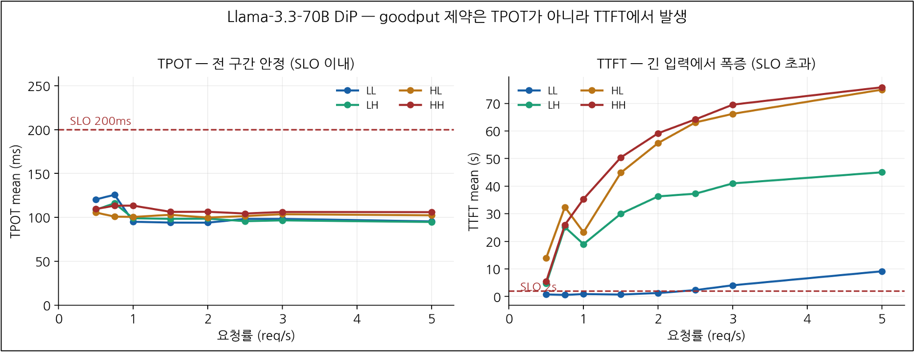

AI 컴퓨팅 오케스트레이션 플랫폼(Backend.AI)을 온프레미스 GPU/NPU 인프라에 구축, 운영하고 그 위에서 다양한 LLM을 서빙했다. 배포에서 끝나지 않고 서빙 과정에서 나온 이슈들의 **원인을 분석하고 해결.** — 검색·RAG 응답 지연, 최신 GPU의 커널 미지원, 이종가속기 분리 서빙의 네트워크·성능 병목 등을 커널 카운터·스케줄러 통계·프레임워크 소스 레벨까지 분석.

주요 진행사항: **① 인프라 구축·운영, ② Open WebUI 검색 성능 개선, ③ GLM-5.2(최신 GPU) 서빙 디버깅, ④ 이종가속기 P/D 분리 서빙.**

---

## ① Backend.AI 인프라 구축 · 운영

여러 서버와 이기종 가속기를 묶어 LLM 서빙 플랫폼을 구축하고, 실사용 가능한 수준까지 운영.

- 단일 서버에 Backend.AI 통합 설치(Halfstack + Manager/AppProxy/Storage/Agent) → 이후 **핵심 컴포넌트를 별도 서버로 마이그레이션**하고 다중 노드를 에이전트로 편입, 자원 그룹 분리
- **Grafana / Prometheus 모니터링** 구축 (vLLM · DCGM · all-smi 메트릭 소스)
- 헬스체크 기반 **자가 복구 · 오토스케일링** 동작 검증
- 여러 모델을 실제 Open WebUI와 연결하여 서빙·운영 (**A.X-4.0, K-EXAONE 236B / 750B, GLM, Llama** 등)

`Backend.AI` `Docker` `Prometheus / Grafana` `vLLM` `LGPLv3 오픈소스`

---

## ② Open WebUI 검색 · RAG 성능 개선

검색 토글을 켜면 답변이 2~10분씩 걸리던 문제를, 안정적인 시간 구간내에 답변하도록 개선.

- 응답 지연이 검색엔진(SearXNG)이 아니라 **Fetch / Batch 단계**임을 관찰(SearXNG 자체는 평균 1.4초, 극단값은 Fetch 최대 10분 · Batch 552청크/5분)
- 원인: `WEB_LOADER_TIMEOUT` 미설정 시 응답 없는 페이지를 **무한 대기**, 긴 페이지 유입 시 청크 폭증
- `docker-compose`에 타임아웃·검색 결과 수 옵션 지정 튜닝 → **극단값 케이스 개선, 전 구간 답변 시간 안정화** (Fetch 0~5초 / Batch 5~21초)
- 부수 이슈 해결: WebUI 설정이 미적용되는 버그(타임아웃·URL 길이·웹로더 등)를 compose 직접 지정으로 우회, tool-choice 옵션으로 검색이 무시되던 문제 발견.

`Open WebUI` `SearXNG` `RAG` `docker-compose` `성능 실측`

---

## ③ GLM-5.2-NVFP4 서빙 디버깅 (최신 GPU 커널 이슈)

743B MoE 모델을 최신 GPU(RTX PRO 6000, Blackwell/SM120)에 올리려다 만난 문제를, vLLM 소스 코드 레벨에서 분석하고, 서빙 가능성을 판단.

- 표준 이미지(vLLM 0.23.0)로 배포 시 `No valid attention backend` — **SM120용 sparse MLA 커널 자체가 없음**을 확인
- 최신 nightly(0.26.0)로 로딩·단순 요청은 성공했으나, 긴 프롬프트에서 엔진 크래시
- 원인: SM120 sparse MLA 구현에 **decode 경로(`forward_mqa`)만 있고 prefill 경로(`forward_mha`)는 미구현** → vLLM 공식 이슈(#49886)와 동일 증상, 환경 문제가 아닌 **프레임워크 자체 버그**로 결론
- 실무 판단: 안정 서빙 방법이 아직 없으므로 프로덕션 불가로 정리

`vLLM` `GLM-5.2 (743B MoE)` `SM120 / Blackwell` `sparse MLA` `커널 디버깅`

---

## ④ 이종가속기 P/D 분리 서빙 (메인 프로젝트)

GPU(prefill)와 NPU(decode)를 분리한 이기종 파이프라인으로 Llama-3.3-70B를서빙하고, slo를 만족하지 못하는 병목이 연산이 아닌 **TTFT, 즉 데이터 이동 파이프라인**에 있다는 것을 벤치마킹을 통해 확인.

```
[입력] → prefill (A100×4, TP4) → KV Cache → [RDMA] → decode (NPU×4) → [출력]
                                     Mooncake / InfiniBand
```

**구축**
- 플랫폼이 미인식하던 신규 NPU(Blackhole)를 가속기 플러그인 패치로 편입(`VALID_CARD_TYPE` 확장 → NPU 4장 정상 인식)
- bridge 모드에서 KV 전송 실패(컨테이너 내부 IP 광고 문제) → **host 네트워크 전환** + Agent 포트 처리 코드 패치로 해결
- prefill/decode/proxy 전 컴포넌트를 수동 기동에서 **Backend.AI 배포로 전환**(헬스체크 자동 복구, 서비스 디스커버리)

**성능 분석**
- 2모델 × 4워크로드 × 8요청률 = **64측정점** goodput 벤치마크
- DiP의 goodput 제약이 TPOT(94~126ms, 안정)가 아니라 **TTFT(긴 입력에서 14s → 70s 폭증)** 병목임을 확인
- 컨테이너화 오버헤드(host 대비 TPOT ~25% ↑, TTFT ~2.4배)를 측정하고, 원인을 `schedstat` 기반으로 추적 (RDMA 실전송은 `port_rcv_data` 카운터로 검증)
- 컨테이너화 오버헤드 원인 분석 중 CPU 사용량이 2000%까지 올라감을 확인 - Future Work

`vLLM` `RDMA / InfiniBand` `Mooncake` `Tenstorrent NPU` `A100` `schedstat`

<!-- 벤치 그래프 자리 (TPOT vs TTFT 대조):

-->

---

## 배운 점

- **실제로 측정해보고 끝까지 의심하기.** RDMA가 실제로 도는지, 병목이 어디인지를 추측이 아니라 커널이 기록하는 로그나 카운팅하는 값들(`port_rcv_data`, `schedstat`)로 확인. 
- **문제를 프레임워크 소스까지 확인하기.** GLM 크래시를 "안 되네"에서 멈추지 않고 `forward_mha` 미구현까지 추적해 공식 이슈와 대조.
- 이기종 서빙의 진짜 난점은 개별 가속기 성능이 아니라 그것들을 **연결하는 파이프라인** (KV 전송, 네트워크, 스케줄링)에 있음을 확인.


## Future Work

- 컨테이너화로 인한 오버헤드에 대한 원인 분석이 현재 끝나지 않음 - CPU를 사용하는 것이 NPU 특성인지, 만약 그렇다면 최적의 CPU할당은 얼마인지를 측정해 볼 수 있음.


## 기술 스택

`Backend.AI` · `vLLM` · `Open WebUI` · `RDMA / InfiniBand` · `Mooncake`
· `Docker` · `Prometheus / Grafana` · `Tenstorrent NPU` · `NVIDIA GPU`
· `schedstat / py-spy` · `Linux` · `Go` · `Python`

